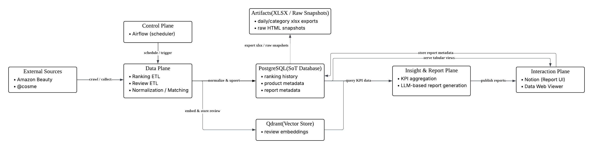
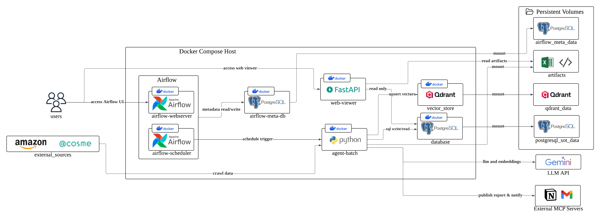

# Kukbingwan Dummy App (MVP Skeleton)

더미 스켈레톤으로 Airflow + agent-batch + Postgres (SoT) + Qdrant + FastAPI Web Viewer를 한 번에 띄우는 구성을 담고 있습니다. 실제 기능 대신 기본 스키마/샘플 데이터/헬스엔드포인트만 제공합니다.

## 아키텍처 다이어그램
- 논리 아키텍처  
  
- 도커 컴포즈 배포 아키텍처  
  

## 설치 및 실행
- 자세한 절차는 `docs/INSTALL.md` 참고.

## 디렉토리 구조
```
.
├─ docker-compose.yml           # 컨테이너 오케스트레이션
├─ .env.example                 # 환경변수 템플릿
├─ migrations/                  # 초기 DDL (SoT)
├─ scripts/                     # 명령어 실행 파일
├─ seed/                        # 샘플 시드 데이터
├─ artifacts/                   # 샘플 xlsx 등 산출물 저장
├─ agent_batch/                 # 배치 CLI 스텁 (Dockerfile, app/)
├─ web_viewer/                  # FastAPI 웹 뷰어 (Dockerfile, app/)
├─ airflow/                     # Airflow DAG 스텁
└─ docs/                        # 추가 문서 (INSTALL 등)
```

## 주요 구성
- `docker-compose.yml`: 7개 서비스(airflow-webserver/scheduler/meta-db, postgres-sot, qdrant, agent-batch, web-viewer) + 볼륨/포트 설정.
- `migrations/0001_init.sql`: ERD 기반 테이블 생성(Postgres SoT).
- `seed/seed.sql`: 플랫폼/카테고리/제품/랭킹/리포트 샘플 데이터.
- `agent_batch/`: `python -m app <subcommand>` CLI 스텁(ranking_etl, review_etl, embed_reviews, report_gen) + Dockerfile/requirements.
- `web_viewer/`: FastAPI read-only 뷰어(`/health`, `/platforms`, `/categories`, `/rankings`, `/reports`, `/downloads/rankings.xlsx`) + Dockerfile/requirements.
- `airflow/dags/`: 4개 DAG 스텁(BashOperator에서 추후 `docker exec agent-batch ...`로 교체 예정).
- `artifacts/`: xlsx 등 산출물 저장 위치(웹뷰어/에이전트와 공유).

## 다음 단계 제안
- Airflow에서 실제 `DockerOperator` 혹은 KubernetesOperator 등으로 agent-batch 호출하도록 교체.
- agent-batch에서 실제 크롤링/임베딩/리포트 로직 연결 및 Qdrant 업서트 구현.
- Web Viewer에 간단한 HTML 템플릿/UI 추가 및 인증(필요 시) 적용.
