# Database Specification

> 목적: Amazon / @cosme 랭킹&리뷰 데이터를 일관된 키로 축적하고, 보고서 생성 및 운영 추적이 가능하도록 SoT 스키마를 정의한다.
원칙: 원문(랭킹/리뷰)는 SoT에 저장하고, Qdrant는 검색 인덱스(파생 저장소)로만 사용한다.
> 

---

## ERD: Database Overview

---

## Specifications

### PLATFORMS

플랫폼(데이터 소스) 차원 테이블. Amazon US / @cosme JP 등 수집 단위를 식별한다.

| Column | Type | Key | Comment |
| --- | --- | --- | --- |
| platform_id | int | PK | 플랫폼 내부 식별자. 다른 테이블에서 FK로 참조한다. |
| name | string |  | 플랫폼 코드명. 예: `amazon_us`, `cosme_jp` 등 고정된 enum 성격. |

### CATEGORIES

플랫폼별 랭킹 수집 대상 카테고리 목록. 수집 URL을 통해 ETL이 어떤 페이지를 크롤링할지 결정한다.

| Column | Type | Key | Comment |
| --- | --- | --- | --- |
| category_id | int | PK | 카테고리 내부 식별자. 플랫폼별 카테고리를 구분한다. |
| platform_id | int | FK → PLATFORMS.platform_id | 어떤 플랫폼의 카테고리인지 식별한다. |
| name | string |  | 카테고리명(내부 표준). 예: `lipcare`, `skincare` 등. |
| source_url | string |  | 크롤링 대상 URL. ETL이 이 URL을 기반으로 랭킹을 수집한다. |

### PRODUCTS

브랜드 단위의 “정규화된 제품” 마스터. 여러 플랫폼의 상품 리스팅을 하나의 제품으로 매핑한다.

| Column | Type | Key | Comment |
| --- | --- | --- | --- |
| product_id | uuid | PK | 정규화된 제품의 내부 UUID. 플랫폼이 달라도 동일 제품이면 같은 ID를 사용한다. |
| brand | string |  | 브랜드명. MVP에서는 Laneige 필터링/집계를 위해 활용한다. |
| name | string |  | 내부 표준 제품명(표시용). |
| canonical_name | string |  | 제품명 정규화 키. 매칭/중복 제거 및 룰 기반 매핑에 사용한다. |
| global_sku | string |  | (선택) 글로벌 SKU/품번. 확보 가능 시 제품 동일성 판단을 강화한다. |
| created_at | datetime |  | 레코드 생성 시각. 제품 마스터 생성/갱신 추적에 사용한다. |
| updated_at | datetime |  | 마지막 수정 시각. 매핑 룰/메타 갱신에 따른 변경 추적에 사용한다. |

### PRODUCT_LISTINGS

플랫폼별 “상품 리스팅” 테이블. 동일 제품이라도 플랫폼/URL/외부 ID가 달라질 수 있어 별도 엔티티로 관리한다.

| Column | Type | Key | Comment |
| --- | --- | --- | --- |
| listing_id | uuid | PK | 플랫폼별 상품 리스팅 식별자. 랭킹/리뷰가 이 엔티티를 참조한다. |
| product_id | uuid | FK → PRODUCTS.product_id | 이 리스팅이 어떤 정규화 제품에 매핑되는지 나타낸다. |
| platform_id | int | FK → PLATFORMS.platform_id | 리스팅이 존재하는 플랫폼. Amazon과 @cosme를 구분한다. |
| product_url | string |  | 상품 상세 페이지 URL. 크롤링/참조 링크로 사용한다. |
| external_id | string |  | 플랫폼 외부 ID. 예: Amazon의 ASIN 등(가능 시 중복 제거/조인에 유리). |
| title_raw | string |  | 수집 시점의 원문 상품 타이틀. 매칭 품질 확인 및 변화 추적에 사용한다. |
| created_at | datetime |  | 리스팅 레코드 생성 시각. 신규 리스팅 발견 시점 추적에 사용한다. |
| updated_at | datetime |  | 리스팅 메타 갱신 시각. URL/타이틀/매핑 변경 추적에 사용한다. |

### RANKING_DAILY

일자/카테고리/플랫폼 기준 TopN 랭킹 fact 테이블. 시계열 랭킹 히스토리의 핵심 SoT이다.

> 권장 PK: `(dt, platform_id, category_id, rank)` 
재실행에도 안정적으로 upsert 가능하도록 설계한다.
> 

| Column | Type | Key | Comment |
| --- | --- | --- | --- |
| dt | date | PK | 랭킹 기준 일자(일 단위 스냅샷). |
| platform_id | int | PK, FK → PLATFORMS.platform_id | 어떤 플랫폼의 랭킹인지 식별한다. |
| category_id | int | PK, FK → CATEGORIES.category_id | 어떤 카테고리의 랭킹인지 식별한다. |
| rank | int | PK | 해당 일자/카테고리에서의 순위(1..N). |
| listing_id | uuid | FK → PRODUCT_LISTINGS.listing_id | 랭킹에 노출된 리스팅. 매칭 실패 시 nullable로 두는 것도 가능하다. |
| product_title_raw | string |  | 랭킹 페이지에 표시된 원문 상품명. 파싱/매칭 검증에 사용한다. |
| product_url | string |  | 랭킹 페이지의 상품 링크. 리스팅 매칭 및 추후 추적에 사용한다. |
| captured_at | datetime |  | 실제 수집 시각. 동일 일자 재수집/지연 수집 여부를 판단한다. |

### REVIEWS

리뷰 원문 fact 테이블(SoT). 임베딩/요약/근거 제시 등 모든 정성 분석의 원본이다.

| Column | Type | Key | Comment |
| --- | --- | --- | --- |
| review_id | uuid | PK | 내부 리뷰 UUID. 중복 제거 후 SoT에서 유일하게 관리된다. |
| listing_id | uuid | FK → PRODUCT_LISTINGS.listing_id | 어떤 상품 리스팅에 달린 리뷰인지 식별한다. |
| platform_id | int | FK → PLATFORMS.platform_id | 리뷰가 수집된 플랫폼. 크로스 플랫폼 분석/필터에 사용한다. |
| external_review_id | string |  | 플랫폼 고유 리뷰 ID(가능 시). 중복 제거 및 증분 수집에 유용하다. |
| rating | float |  | 별점/점수(있는 플랫폼만). 긍부정 분해 및 KPI에 활용한다. |
| title | string |  | 리뷰 제목(있는 플랫폼만). 본문 요약/키워드에 보조 신호로 사용한다. |
| body | text |  | 리뷰 본문 원문. 임베딩 및 요약/근거 제시에 직접 사용한다. |
| author | string |  | 작성자 정보(가능 시). 개인 식별 목적이 아니라 중복/스팸 판별 보조용. |
| reviewed_at | datetime |  | 리뷰 작성일. 시계열 트렌드 분석의 기준 시간이다. |
| language | string |  | 언어 코드. 예: `en`, `ja`. 번역/모델 선택 로직에 활용한다. |
| crawled_at | datetime |  | 실제 수집 시각. 증분 수집 및 재수집 여부 판단에 사용한다. |
| hash | string |  | 본문 기반 해시(또는 외부 ID 대체). 외부 ID가 없을 때 중복 제거에 사용한다. |

### REVIEW_EMBEDDINGS

Qdrant에 저장된 벡터 인덱스 상태를 SoT에서 추적하는 테이블. 재처리/재시도/모델 교체를 가능하게 한다.

| Column | Type | Key | Comment |
| --- | --- | --- | --- |
| review_id | uuid | PK, FK → REVIEWS.review_id | 어떤 리뷰를 임베딩했는지 식별한다(리뷰와 1:1 관계). |
| vector_store | string |  | 사용한 벡터 스토어 종류. MVP에서는 `qdrant`로 고정 가능하다. |
| collection | string |  | Qdrant 컬렉션명. 버전 관리(예: `reviews_v1`)에 활용한다. |
| point_id | string |  | Qdrant 내 point 식별자. 삭제/갱신/검증 시 사용한다. |
| embedding_model | string |  | 사용한 임베딩 모델명. 모델 변경 시 품질 비교 및 재임베딩 기준이 된다. |
| embedded_at | datetime |  | 임베딩 및 업서트 완료 시각. 증분 처리/재처리 판단에 사용한다. |
| status | string |  | `success`/`failed` 등 처리 상태. 배치 품질 모니터링에 활용한다. |
| error_message | text |  | 실패 사유 로그. 재시도 정책 및 장애 분석에 사용한다. |

### REPORTS

자동 생성된 보고서 메타 및 (선택) 본문 저장. Notion URL을 통해 사용자에게 공유하며, SoT에는 추적 가능한 형태로 남긴다.

| Column | Type | Key | Comment |
| --- | --- | --- | --- |
| report_id | uuid | PK | 보고서 내부 UUID. 기간/범위별 보고서를 유일하게 식별한다. |
| period_start | date |  | 분석 시작일. KPI 계산 및 보고서 범위 정의에 사용한다. |
| period_end | date |  | 분석 종료일. period_start와 함께 리포트 스냅샷 범위를 고정한다. |
| platform_scope | string |  | 분석 대상 플랫폼 범위. `amazon`/`cosme`/`both` 등. |
| category_scope | text |  | 분석 대상 카테고리 범위(JSON/텍스트). 재현 가능한 스코프를 기록한다. |
| notion_url | string |  | 발행된 Notion 페이지 URL. 사용자는 이 링크로 보고서를 소비한다. |
| summary | text |  | 짧은 요약(1~3문장). 목록/알림/검색용 메타로 활용한다. |
| content_markdown | text |  | (선택) 보고서 본문 마크다운. Notion 발행 실패 대비 및 향후 검색에 활용한다. |
| created_at | datetime |  | 보고서 생성 시각. 아카이빙 및 최근 보고서 조회에 사용한다. |

### JOB_RUNS

운영/관측(Ops) 목적의 실행 이력 테이블. 배치 실행 상태, 처리량, 오류를 구조화해 저장한다.

| Column | Type | Key | Comment |
| --- | --- | --- | --- |
| run_id | uuid | PK | 실행 이력 내부 UUID. 재시도/장애 분석에서 기준 키가 된다. |
| dag_id | string |  | Airflow DAG 식별자. 어떤 파이프라인 실행인지 구분한다. |
| task_id | string |  | Airflow task 식별자. 실패 지점을 빠르게 특정한다. |
| logical_date | datetime |  | Airflow 실행 기준 시간(execution date). 백필/스케줄링 단위를 맞춘다. |
| status | string |  | `running`/`success`/`failed`. 운영 대시보드/알림 트리거에 사용한다. |
| started_at | datetime |  | 실제 시작 시각. 실행 시간 측정/성능 추적에 사용한다. |
| ended_at | datetime |  | 실제 종료 시각. 실행 시간 및 SLA 판단에 사용한다. |
| stats_json | text |  | 처리 건수/지표(JSON). 예: ranking rows, new reviews, embedded count 등. |
| error_message | text |  | 실패 사유 요약. 운영자가 원인을 빠르게 파악하도록 돕는다. |
